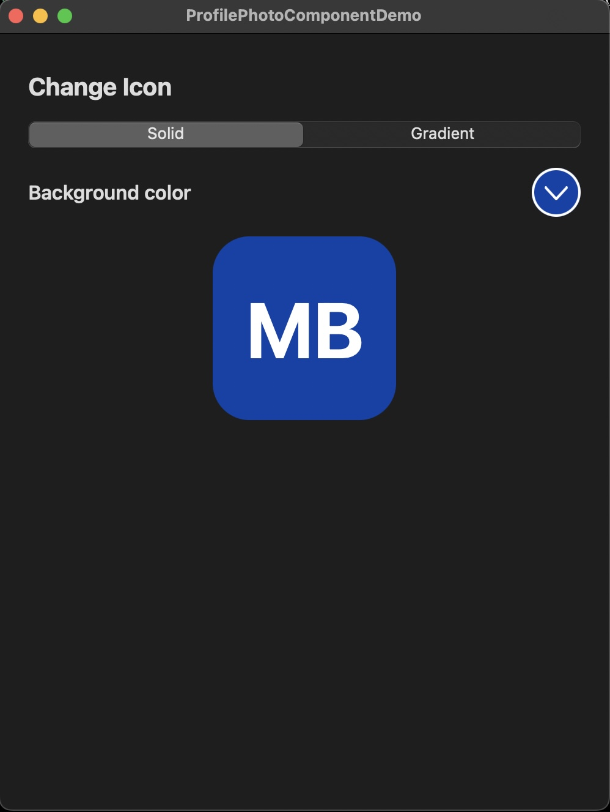

# ProfilePhotoComponentDemo

**ProfilePhotoComponentDemo** is a Swift project that serves as a showcase for a simple and reusable UI component designed for updating a user's profile icon. Notable features and details include:

- The user interface is constructed programmatically.
- It's compatible with iOS 14.0 and macOS 11.0 (Mac Catalyst), ensuring wide platform support.
- The component seamlessly adapts to both light and dark modes.
- The project is committed to continuous improvement, hence the utilization of native controls with default styling.

## Screenshots

### iPhone (Light Mode)

### Mac OS (Dark Mode)

## Implementation Details

To minimize third-party dependencies, the project leverages the `UIKit` and `Combine` frameworks. For snapshot testing, I employ the well-known [swift-snapshot-testing](https://github.com/pointfreeco/swift-snapshot-testing) library, avoiding additional external dependencies.

The project includes a Swift package named [UIComponents](https://github.com/marcin-bo/ProfilePhotoComponentDemo/tree/main/ProfilePhotoComponentDemo/Packages/UIComponents), designed for easy reusability. In addition, you can explore unit and snapshot tests [here](https://github.com/marcin-bo/ProfilePhotoComponentDemo/tree/main/ProfilePhotoComponentDemo/Packages/UIComponents/Tests/UIComponentsTests).

The primary control, [ProfilePhotoComponentViewController](https://github.com/marcin-bo/ProfilePhotoComponentDemo/blob/main/ProfilePhotoComponentDemo/Packages/UIComponents/Sources/UIComponents/Components/ProfilePhotoComponentViewController/ProfilePhotoComponentViewController.swift), is constructed using view controller composition through child view controllers.

## How to Use the Component

To observe the component in action, you can refer to the example usage demonstrated in the [ViewController](https://github.com/marcin-bo/ProfilePhotoComponentDemo/blob/main/ProfilePhotoComponentDemo/View%20Controllers/ViewController.swift) within the main target.

## To-Do List & Known Issues

Here's a summary of tasks on my to-do list and known issues:

- Expanding unit tests, with a particular focus on testing binding behavior.
- Implementing the option to select an image from disk, camera, or photo library.
    - The necessary [model](https://github.com/marcin-bo/ProfilePhotoComponentDemo/blob/main/ProfilePhotoComponentDemo/Packages/UIComponents/Sources/UIComponents/Components/ProfileIconView/Model/ProfileIcon.swift) and [UI control](https://github.com/marcin-bo/ProfilePhotoComponentDemo/blob/main/ProfilePhotoComponentDemo/Packages/UIComponents/Sources/UIComponents/Components/ProfileIconView/ProfileIconView.swift) components are already prepared; what remains is their integration into the view controller.
- Resolving the appearance issue of the [rounded view with selected colors](https://github.com/marcin-bo/ProfilePhotoComponentDemo/blob/main/ProfilePhotoComponentDemo/Packages/UIComponents/Sources/UIComponents/Components/SelectedColorView/SelectedColorView.swift) when those colors are close to white.
